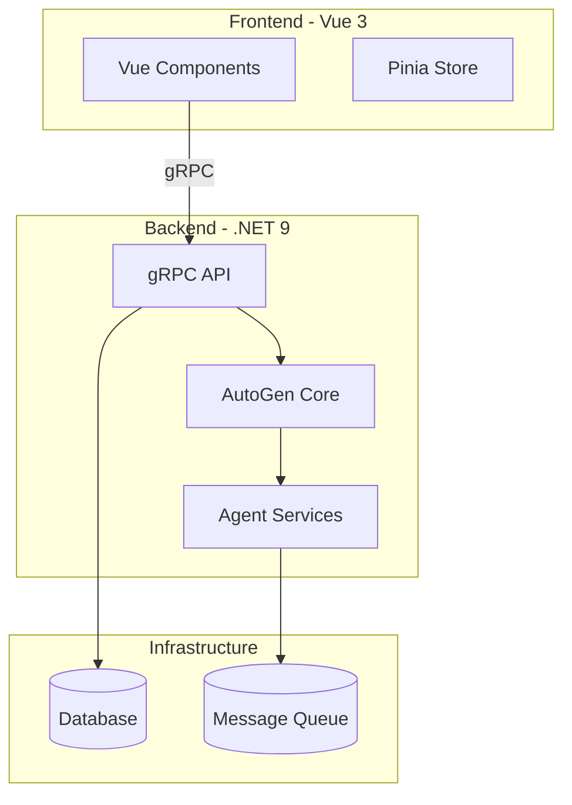

# AI-SDK-AUTOGEN

[](https://github.com/mk-knight23/AI-SDK-ECOSYSTEM)
[](https://github.com/microsoft/autogen)
[](https://vuejs.org/)
[](https://dotnet.microsoft.com/)

> **Framework**: Microsoft AutoGen (Multi-Agent Communication)
> **Stack**: Vue 3 + .NET 9 + gRPC

---

## 🎯 Project Overview

**AI-SDK-AUTOGEN** demonstrates distributed multi-agent systems using Microsoft AutoGen. It shows agents running on separate cloud providers communicating via gRPC, enabling truly distributed AI systems with fault tolerance and scalability.

### Key Features

- 🤖 **Multi-Agent Communication** - gRPC-based agent messaging
- ☁️ **Multi-Cloud Deployment** - Agents on different cloud providers
- 🔄 **Fault Tolerance** - Agent recovery and redundancy
- 📊 **Supply Chain Logic** - Real-world distributed scenarios
- 🔌 **Provider Integration** - Azure OpenAI, MiniMax, Cerebras

---

## 🛠 Tech Stack

| Technology | Purpose |
|-------------|---------|
| Vue 3 | Frontend framework |
| .NET 9 | Backend framework |
| AutoGen 0.4 | Agent framework |
| gRPC | Agent communication |
| RabbitMQ | Message queue |
| Pinia | State management |

---

## 🚀 Quick Start

```bash
# Frontend
cd frontend && npm install && npm run dev

# Backend
cd backend && dotnet run
```

---

## 🔌 API Integrations

| Provider | Usage |
|----------|-------|
| Azure OpenAI | Primary LLM |
| MiniMax | Chinese language |
| Cerebras | Ultra-fast inference |
| NVIDIA NIM | GPU acceleration |

---

## 📦 Deployment

**Azure Container Apps**

```bash
az container app up
```

---

## 🏗️ Architecture

### System Design

```
┌─────────────────────────────────────────────────────────────────────────────┐
│                              Frontend (Vue 3)                               │
│  ┌─────────────┐  ┌──────────────┐  ┌─────────────┐  ┌─────────────────┐   │
│  │ Agent Chat  │  │ Code Exec    │  │ Group Chat  │  │ Agent Dashboard │   │
│  └──────┬──────┘  └──────┬───────┘  └──────┬──────┘  └────────┬────────┘   │
│         └────────────────┴──────────────────┴──────────────────┘            │
│                                    │ SignalR/WebSocket                       │
└────────────────────────────────────┼─────────────────────────────────────────┘
                                     │
┌────────────────────────────────────┼─────────────────────────────────────────┐
│                              Backend (.NET 9)                                │
│  Controllers → Services → Repositories → PostgreSQL + Redis                  │
│  SignalR Hub → gRPC → AutoGen Agents (Python/.NET)                          │
└─────────────────────────────────────────────────────────────────────────────┘
```

### Core Features

#### Multi-Agent Conversations
- Real-time agent-to-agent messaging via SignalR
- Conversation threading and history
- Agent role management (system, user, assistant)
- Message routing and broadcasting

#### Code Execution
- Docker-based sandboxed execution
- Support for Python, JavaScript, C#
- Execution output capture (stdout, stderr)
- Resource limits and timeout management

#### Group Chat Patterns
- Sequential round-robin chat
- Moderator/broadcast patterns
- Dynamic agent joining/leaving
- Topic-based conversations

### API Endpoints

| Endpoint | Description |
|----------|-------------|
| `GET /api/agents` | List all agents |
| `POST /api/agents` | Create new agent |
| `GET /api/conversations` | List conversations |
| `POST /api/conversations/{id}/messages` | Send message |
| `POST /api/code/execute` | Execute code |
| `GET /api/groups` | List group chats |

---

## 🏗️ Architecture



---

## 📡 API Endpoints

| Method | Endpoint | Description |
|--------|----------|-------------|
| GET | /api/agents | List all agents |
| POST | /api/agents | Create new agent |
| GET | /api/conversations | List conversations |
| POST | /api/conversations/{id}/messages | Send message |
| POST | /api/code/execute | Execute code |
| GET | /api/groups | List group chats |

---

## 🔧 Troubleshooting

### Common Issues

**Connection refused**
- Ensure .NET backend is running: `cd autogen-service && dotnet run`
- Check gRPC port is available

**Agent communication failures**
- Verify all agents are registered
- Check gRPC server is accessible
- Review agent configuration

**Code execution errors**
- Verify code execution sandbox is running
- Check permissions for code execution

---

## 📚 Additional Documentation

- [API Reference](docs/API.md) - Complete API documentation
- [Deployment Guide](docs/DEPLOYMENT.md) - Platform-specific deployment
- [Testing Guide](docs/TESTING.md) - Testing strategies and coverage

---

## 📝 License

MIT License - see [LICENSE](LICENSE) for details.

---

**Part of the [AI-SDK Ecosystem](https://github.com/mk-knight23/AI-SDK-ECOSYSTEM)**
